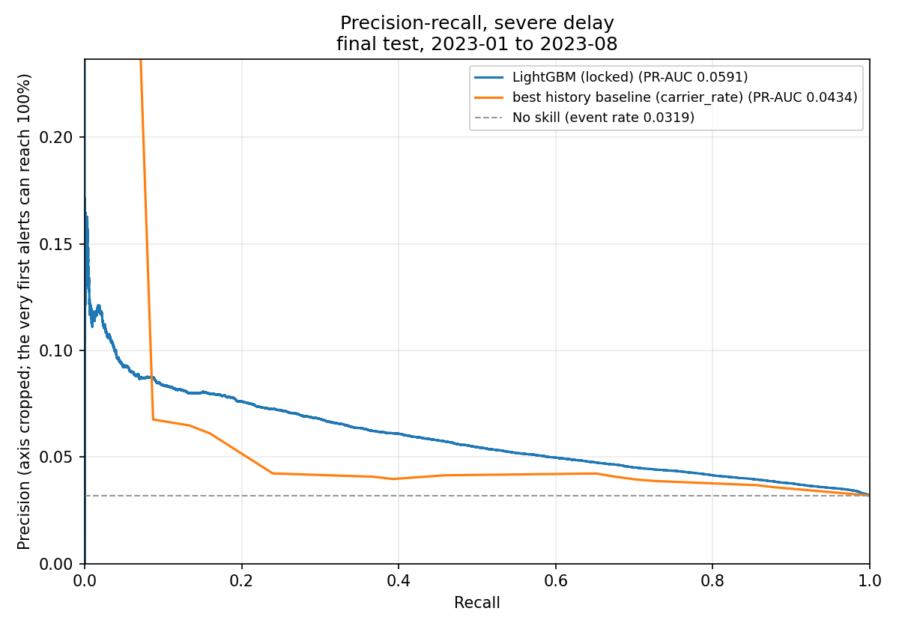
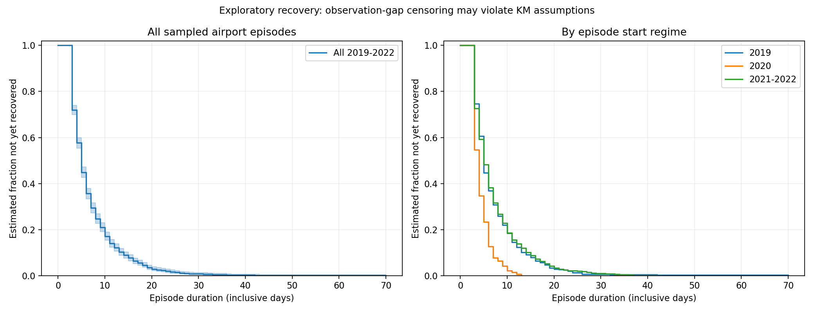
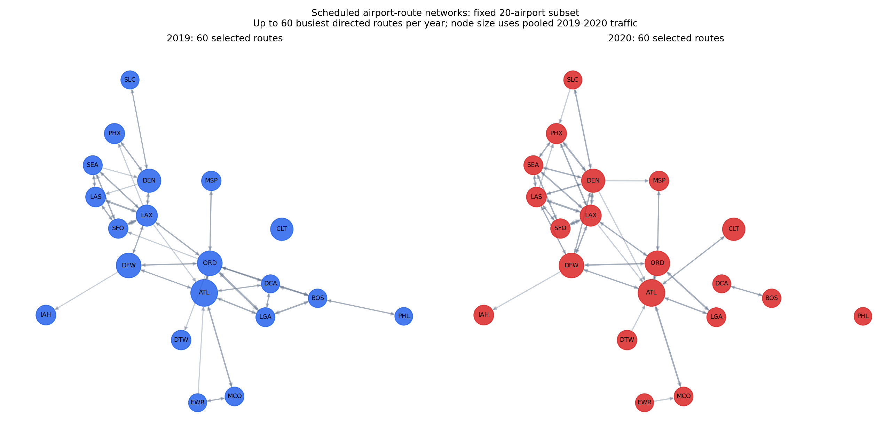
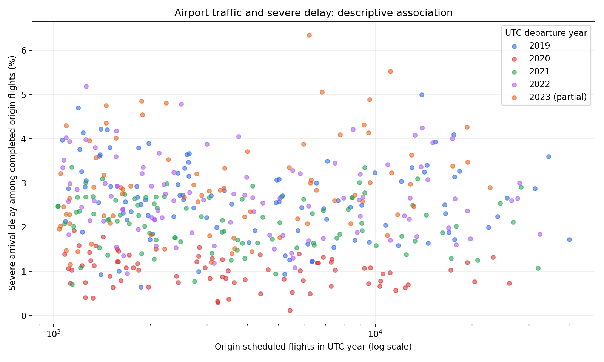

<!-- generated by scripts/build_phase7_reports.py -->
# Airline Network Disruption Intelligence: Delay Prediction, Propagation, Recovery and Network Resilience

This project looks at flights that land two or more hours late, and at flights that are cancelled. It asks one simple question: two hours before a flight leaves, can its schedule alone tell us which flights are more likely to be badly delayed? These flights are rare (3.19% of the 2023 flights in this data), so the question is hard. The project also studies how airports and routes behave when disruption builds up and when it clears, and how far the predicted probabilities can be trusted.

> **Scope:** This is an advanced portfolio study for Data Science, applied science, forecasting, operations research, decision science, transportation analytics and aviation analytics roles. It is a retrospective analysis of flight-level records. It is not an airline operating system, a dispatch or control tool, a real-time system or a production service. It has no API, no deployment, no streaming and no live airline data.

## The project in plain words

- A flight counts as **severely delayed** here if it lands 120 minutes (2 hours) or more after its planned arrival time. This line is our own choice, not an official rule. In the 2023 test data, 3.19% of flights were severely delayed.
- The model sees only what is known **two hours before departure**: the planned time, the airline, the two airports and the route. It never sees what happens on the day.
- We trained on flights from 2019-01 to 2021-06 (UTC prediction time), stopped training early using 2021-07 to 2021-12, chose between models on 2022, locked every choice in a sealed file, and then scored 2023-01-01 to 2023-08-31 local flight date (UTC prediction time from 2023-01-01) once.
- The model ranks severe delays better than chance and better than the strongest simple rule. Its PR-AUC is 0.0591, which is 1.85 times what a random ranking would score. Even so, most severe delays (79%) are not in its top 10% of flights each day.
- Cancellations: no model was selected. The baseline showed no skill over chance and did not beat the strongest history rule.
- 4 neural-network models were tested and rejected. The simpler LightGBM model is the result, and that is a valid outcome.

## Project outcome

The numbers below come from the 2023 final test. The model was scored on these flights once.

| Final test measure | Result |
| --- | --- |
| Model | LightGBM with 12 schedule, carrier, airport and route features, locked before 2023 was read |
| Final test period | 2023-01-01 to 2023-08-31 local flight date (UTC prediction time from 2023-01-01) |
| Flights scored | 454,413 |
| Severely delayed flights | 14,484 |
| Share of flights severely delayed | 3.19% |
| PR-AUC of the model | 0.0591 (0.0540 to 0.0652) |
| PR-AUC of the strongest simple rule (carrier history) | 0.0434 |
| Lift over chance | 1.85 |

**What-if review lists.** Each day, flights are ranked by predicted risk and the top share is flagged for review. A false alert is a flagged flight that was not severely delayed.

| Share of each day's flights reviewed | Flights reviewed | Severe delays caught | Share of all severe delays caught | Reviewed flights that were severely delayed | False alerts |
| --- | --- | --- | --- | --- | --- |
| 0.5% | 2,386 | 212 | 1.5% | 8.9% | 2,174 |
| 1% | 4,668 | 412 | 2.8% | 8.8% | 4,256 |
| 5% | 22,837 | 1,686 | 11.6% | 7.4% | 21,151 |
| 10% | 45,547 | 3,037 | 21.0% | 6.7% | 42,510 |

The review lists are a what-if on past data. They show how well the ranking works. They are not airline decisions, costs or savings.

## Words used in this README

- **Severe delay**: the flight lands 120 minutes or more after its planned arrival time. This line is a project choice, not an official rule.
- **Prediction time**: 2 hours before the planned departure. The model may use only what is known by then.
- **Leakage**: using information that was not known at prediction time. It makes results look better than they are.
- **Date-based split**: train on earlier dates and test on later dates, as in real use. Flights are never shuffled across time.
- **Baseline**: a simple rule, such as a carrier's past delay rate. A model must beat it to be worth using.
- **PR-AUC**: a score from 0 to 1 for how well a model puts rare events at the top of a ranked list. Random ranking scores about the event rate.
- **Lift**: PR-AUC divided by the event rate. A lift of 1 means no better than chance.
- **Precision and recall**: precision is the share of flagged flights that were really delayed. Recall is the share of all delayed flights that were flagged.
- **Calibration**: whether a predicted 5% chance really happens about 5% of the time.
- **SHAP**: a method that splits one prediction into the part each feature added. It describes the model, not the real world.

## Questions this project answers

1. Which flights are likely to see severe arrival delay or cancellation?
2. Which operational variables are associated with disruption risk?
3. How does disruption pressure vary across airports and routes over time?
4. How quickly do airport-level disruption episodes recover?
5. Which airports and routes show more exposure or downstream scheduled pressure?
6. Do schedule, airport, route and network features add predictive value?
7. Do LSTM, GRU or a compact Transformer improve on the strong tabular model?
8. Does sequence information add value beyond the tabular baseline?
9. How reliable are the probabilities across operating regimes?
10. Which flights could be prioritised under transparent retrospective review scenarios?

The final technical report gives the answer to each question and names the file that holds the evidence.

## Dataset

- One source: the [Flight Delay and Cancellation Dataset 2019 to 2023](https://www.kaggle.com/datasets/patrickzel/flight-delay-and-cancellation-dataset-2019-2023) on Kaggle. The file is `data/raw/flights_kaggle/flights_sample_3m.csv`. The audit found about three million flights from 2019-01-01 to 2023-08-31.
- The full data are not in this repository. Raw data stay unchanged under `data/raw/`. Processed data, model files and logs are ignored by Git.
- Weather data were part of the first plan. The final pipeline uses flight data only, and no weather result is claimed.
- The source page, access date, file hash, row counts, coverage and licence terms are in `docs/data/source_metadata.md`.
- The data card is `docs/data/data_card.md`.
- The data belong to their publisher. This repository's licence does not cover them.

## Methodology

### Leakage-safe evaluation

- Prediction timestamp: scheduled departure UTC minus 2 hours. A feature can use only what is known by then.
- Left out for the flight being predicted: actual departure and arrival times, arrival delay, delay causes, whether it was cancelled, and any final-status field.
- Airports sit in different time zones. Local times are kept as given. An audited airport time-zone table gives UTC times for ordering. Times at two airports are never subtracted directly.
- Splits follow the calendar. Fit: 2019-01 to 2021-06 (UTC prediction time). Early stopping: 2021-07 to 2021-12. Validation: 2022. Final test: 2023-01-01 to 2023-08-31 local flight date (UTC prediction time from 2023-01-01).
- Encoders, imputers, calibrators and settings are fitted only on earlier periods.
- The 2023 rows were not used for any choice. The model, settings, calibrator, cutoffs and pass/fail checks were fixed in a sealed lock file before 2023 was scored, and the test was run once. The 2023 event rate was known from the earlier data audit and is disclosed in the decision log. No model, calibration or policy choice used it.
- The source has no usable aircraft identifier, so the study does not build aircraft rotations or claim aircraft-level propagation.
- The years are treated as different regimes: 2019 before COVID, the 2020 shock, 2021 to 2022 recovery, and partial 2023. 2020 is kept and treated as a distribution shift.
- The full audit is in `docs/data/leakage_audit.md`.

### Models and calibration

- Simple baselines first: the overall rate, and the past rate of each carrier, origin airport, destination airport and route. Each uses earlier rows only.
- Then Logistic Regression, LightGBM and XGBoost, on the same date splits and the same features. Linear, Ridge and Elastic Net models were used for arrival-delay regression.
- The main score is PR-AUC, which suits rare events. Accuracy is not used. A model that always says "not severely delayed" would be right for 96.8% of flights and find none of the delays.
- Also reported: precision, recall, F1, ROC-AUC, Brier score and reliability curves.
- Probability calibration: these ways were compared on 2022 data: no calibration, Platt scaling and isotonic regression. Platt scaling (a sigmoid curve) was chosen. It was fitted on 2021-07-01 to 2021-12-31 UTC (the early-stopping rows) data and never on 2023.
- Ranking uses the raw model score. Calibrated probabilities are used only for the probability checks.

### Review scenarios

- Each day, flights are ranked by predicted risk, and the top 0.5%, 1%, 5% or 10% are flagged for a what-if review.
- Ranking inside each day is the fair test. Ranking the whole period could just pick flights from busy seasons.
- Any penalty weights used in the reports are illustrative. No airline cost or saving is claimed.

## Advanced experiments

- LSTM, GRU and a compact Transformer were tested on airport schedule sequences, with a plain neural network (MLP) as a control. They were tried only after the tabular pipeline was stable.
- The sequences use earlier schedule records only. They are not aircraft sequences, because the source has no usable aircraft identifier.
- No challenger earned a place on the 2022 evidence, so none was scored on 2023:
  - `lstm`: did not beat the MLP control that never sees the lookback (DEC-020).
  - `gru`: no clear gain over the LSTM or the MLP control (DEC-020).
  - `transformer`: whole interval below zero against both the MLP control and tuned LightGBM, overfits from epoch 1 (DEC-022).
  - `mlp_control`: not better than tuned LightGBM on validation.

## Explainability and error analysis

- SHAP on 2022 data: the features that moved the model most were carrier_identifier (25%), scheduled_departure_hour_local (18%), scheduled_departure_month (17%). The biggest feature group was calendar and clock, at 46% of the total.
- SHAP shows what the model used. It does not show what caused a delay.
- Inside each day, the top 10% list leaves 11,447 severe delays outside it and holds 42,510 flights that were not severely delayed.
- The top 1% list catches 412 severe delays and holds 4,256 false alerts.
- A single score hides a lot. The error analysis report breaks the results down by period, carrier, airport, hour, delay size and missing data.

## Results in more detail

**Severe arrival delay (120 minutes or more), 2023 final test, scored once.**

| Scorer | PR-AUC | 95% interval | Lift | ROC-AUC |
| --- | --- | --- | --- | --- |
| LightGBM (locked model) | 0.0591 | (0.0540 to 0.0652) | 1.85 | 0.656 |
| overall rate | 0.0319 | (0.0296 to 0.0344) | 1.00 | 0.500 |
| carrier history | 0.0434 | (0.0405 to 0.0466) | 1.36 | 0.592 |
| origin airport history | 0.0378 | (0.0349 to 0.0412) | 1.19 | 0.564 |
| destination airport history | 0.0379 | (0.0350 to 0.0412) | 1.19 | 0.567 |
| route history | 0.0386 | (0.0356 to 0.0417) | 1.21 | 0.568 |

Calibration: the ratio of predicted to observed severe delays was 0.928 on 2022 and 0.826 on 2023. A ratio of 1 is perfect. The severe-delay rate rose from 2.67% to 3.19%, so the probabilities were too low in 2023. A fixed probability cutoff is not stable when the event rate moves.

**Regression, recovery and network.** Arrival-delay regression models were checked on validation data only. No regression model was locked, so none was scored on 2023. Airport recovery, network and association results are in the reports listed below.

## Repository structure

```text
airline-network-disruption-intelligence/
├── configs/                 # Settings for the analysis, saved as versioned files
├── docs/                    # Data card, method notes and the decision log
├── reports/evaluation/      # The written reports
├── reports/tables/          # Small result tables and the final decision record
├── reports/figures/         # Charts used in the reports
├── reports/final/           # The sealed final-test lock and the record that the test was used
├── scripts/                 # One command per step, plus the report builder and the repository check
├── src/airline_disruption/  # The reusable code: features, validation, models, calibration, explanation, reporting
├── tests/                   # Automatic tests, including leakage, timestamp, date-split, calibration and metric tests
└── data/                    # Raw and processed data. Not in Git
```

## Key reports

- [`reports/evaluation/final_technical_report.md`](reports/evaluation/final_technical_report.md): The whole study in one document
- [`reports/evaluation/final_model_selection_report.md`](reports/evaluation/final_model_selection_report.md): Which model was chosen, which were rejected, and why
- [`reports/evaluation/calibration_and_alert_policy_report.md`](reports/evaluation/calibration_and_alert_policy_report.md): How reliable the probabilities are, and the what-if review lists
- [`reports/evaluation/explainability_report.md`](reports/evaluation/explainability_report.md): What the model uses to make its predictions (SHAP)
- [`reports/evaluation/error_analysis_report.md`](reports/evaluation/error_analysis_report.md): Where the model fails: by period, hour, carrier, airport and delay size
- [`reports/evaluation/network_resilience_report.md`](reports/evaluation/network_resilience_report.md): The airport and route network
- [`reports/evaluation/survival_recovery_report.md`](reports/evaluation/survival_recovery_report.md): How long airport disruption episodes last
- [`reports/evaluation/propagation_report.md`](reports/evaluation/propagation_report.md): How disruption at airports and routes is linked over time (not aircraft-level)

## Figures










## Reproducibility

### 1. Environment (Windows PowerShell)

```powershell
python -m venv .venv
.\.venv\Scripts\Activate.ps1
pip install -e .
```

The package and its dependencies are defined in `pyproject.toml`. The final test ran on Python 3.13.5. On macOS or Linux, activate with `source .venv/bin/activate`.

### 2. Get the data

Download the flight file from [Kaggle](https://www.kaggle.com/datasets/patrickzel/flight-delay-and-cancellation-dataset-2019-2023) and place it at `data/raw/flights_kaggle/flights_sample_3m.csv`. Do not edit it. Raw data are never committed.

### 3. Run the tests

```powershell
python -m pytest -q
```

### 4. Rebuild the final steps

```powershell
python scripts/run_phase7a_explain_and_errors.py
python scripts/run_phase7b_final_lock.py
python scripts/run_phase7b_final_test.py --confirm USE-2023-ONCE
python scripts/build_phase7_reports.py
```

The final test step is meant to run once. A rerun must reproduce the stored scores.

Before committing, run `python scripts/check_repo_hygiene.py`. It refuses data, model files, test outputs and credentials.

## Limitations

- A single period (Jan to Aug 2023): one regime, no regime comparison inside the final test.
- The model saw nothing after 2021-06; the gap to 2023 is 18 to 26 months.
- Schedule-only features: no same-day airport state, no weather, no aircraft identity.
- Penalty table values are assumptions, never airline costs.
- Regression (MAE) and airport recovery episodes are not part of this test.
- The model uses the schedule only. It cannot see an airport's state on the day, so it cannot see disruption building up before the prediction time.
- Results are associations in past data. They do not say why a flight was late or what an airline could have done.
- The review scenarios use illustrative weights. They are not airline costs or operating decisions.
- Scope and appropriate use are set out in `docs/decisions/limitations_and_appropriate_use.md`.

The evidence does not support:

- Weather or any other cause of a delay (the data holds no weather and no cause for the flights scored here)
- Aircraft or tail-number propagation (the source has no usable tail identifier, so no aircraft sequence is built)
- Causal statements about airports, carriers, routes or schedules (every result is an association)
- Real airline costs, savings or operating decisions (utility figures are illustrative penalty units)
- Any claim about flights after 2023-08-31, or about other airlines or countries

## Portfolio claim

This project tests flight-level disruption prediction using date-based validation, features known two hours before departure, calibrated probabilities, a sealed once-only final test, airport and route network analysis, airport-level recovery analysis, sequence-model challengers, SHAP explanations, error analysis and what-if review lists. The simpler tabular model won, and the evidence for that is in the reports.


