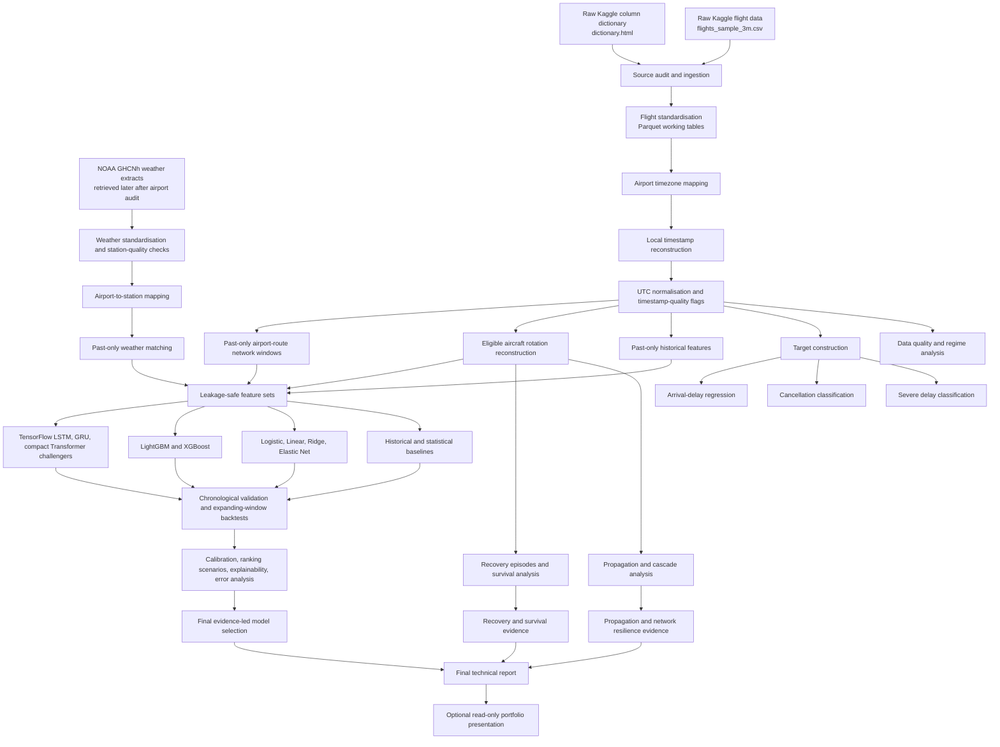

# Analytical Architecture

## Architecture rules

- The official pipeline contains exactly two external sources: the selected Kaggle flight dataset and NOAA GHCNh historical weather observations.
- Raw source files remain immutable under `data/raw/` and are excluded from Git.
- Original local time fields are retained, while UTC-normalised timestamps are used for ordering, joining, weather matching, and sequence construction.
- Every predictive feature must be available by the documented prediction timestamp.
- Model evaluation uses chronological validation and an untouched final temporal test period.
- Aircraft-level propagation and recovery claims are restricted to eligible validated tail-number sequences.
- LSTM, GRU, and Transformer models are challengers evaluated only after stable tabular pipelines exist.
- The project is retrospective analytical research, not live airline operational software.