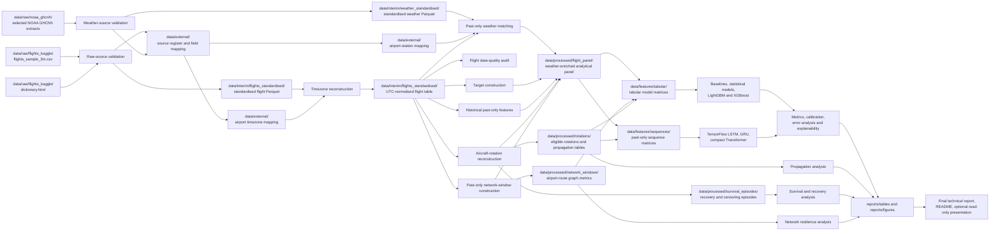

# Data Lineage

## Lineage controls

- `data/raw/` contains immutable downloaded source material and is excluded from Git.
- `data/interim/`, `data/processed/`, and `data/features/` contain generated outputs and are excluded from Git.
- `data/external/` stores small, versioned documentation and mappings required to reproduce the pipeline.
- Every transformation must have a documented script, configuration, input source, output location, and quality check.
- Flight and weather lineage must retain source file identity, source schema version, processing time, and file hashes where feasible.
- Every feature used in a predictive model must be traceable to its source fields, transformation logic, availability time, and leakage-control rule.
- Only small permitted or synthetic examples may be stored in `data/sample/`.