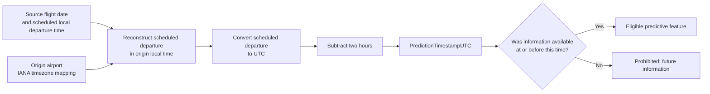
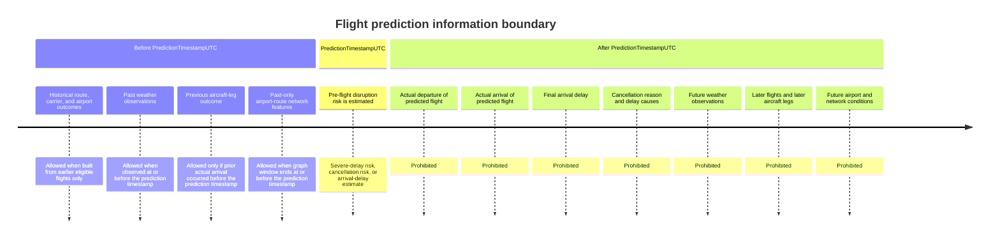
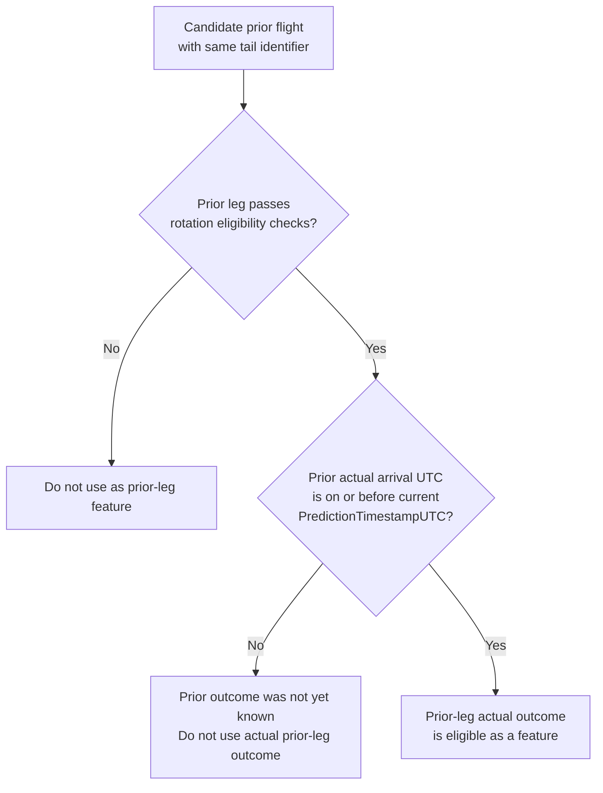
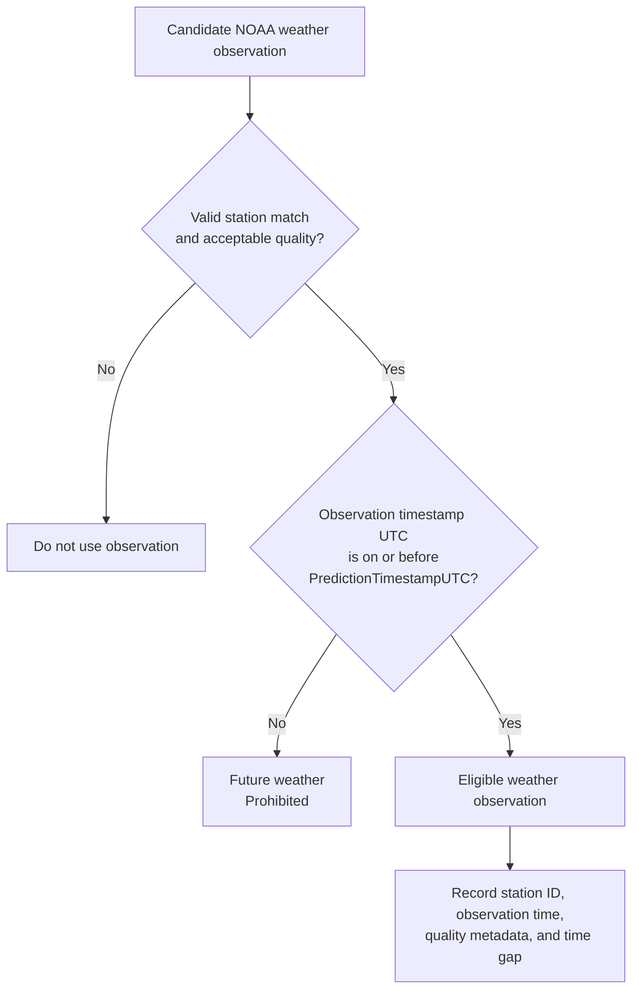

# Prediction Timestamp Design

## Primary pre-flight prediction horizon

For each scheduled flight:

```text
PredictionTimestampUTC = ScheduledDepartureTimestampUTC - 2 hours
```

The model estimates disruption risk using only information available on or before this UTC timestamp.



## Information timeline



## Previous-aircraft-leg decision rule



## Weather-observation decision rule



## Non-negotiable rules

- Scheduled departure is reconstructed from the source flight date, scheduled local departure time, and origin-airport timezone.
- UTC is used for feature availability checks, weather matching, aircraft sequencing, network windows, and time comparisons.
- Original local source time fields are retained for auditability.
- A model must never use actual outcomes from the flight it predicts.
- A model must never use future weather, future flights, future prior-leg outcomes, future airport measures, or future network information.
- Historical aggregates, encoders, scalers, imputers, calibration methods, feature selection, and tuning must be fitted inside chronological training folds only.
- The final temporal test period must not influence feature, model, calibration, threshold, or policy selection.