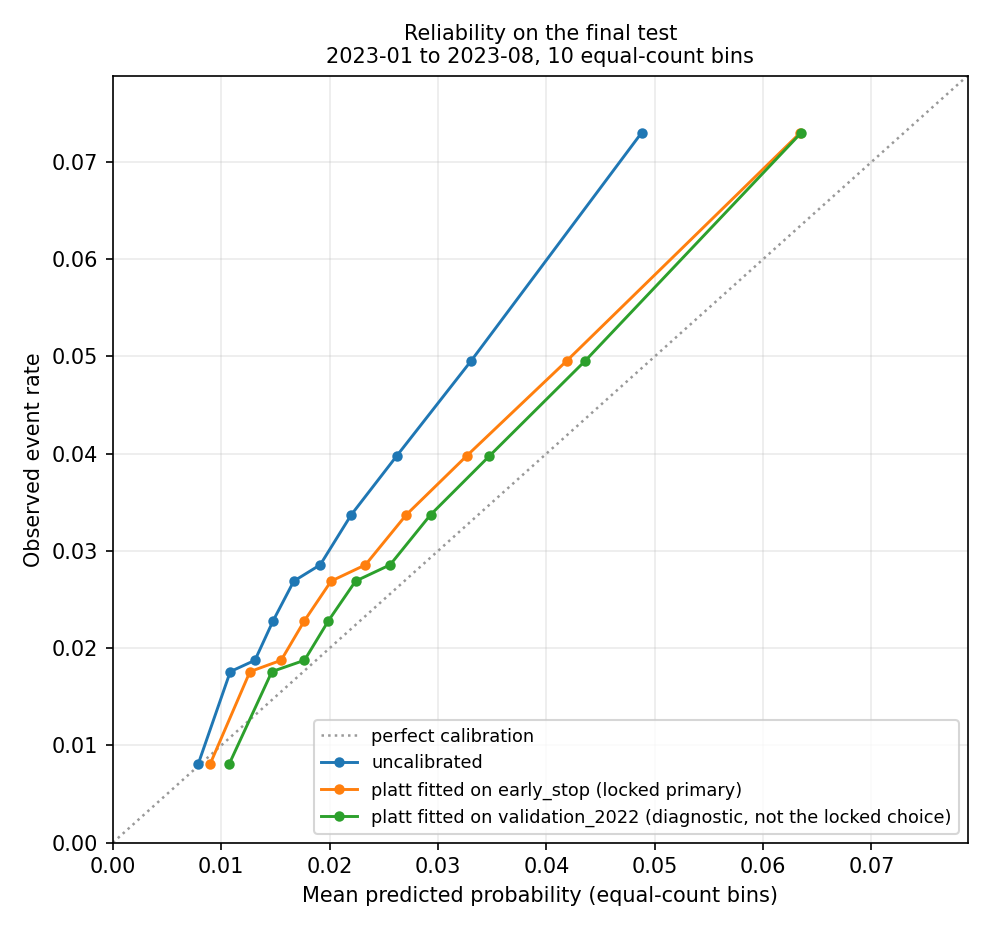
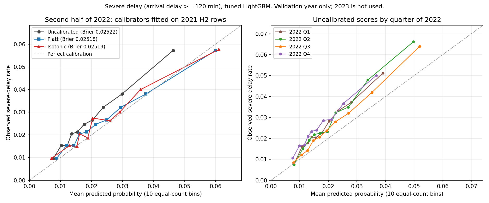
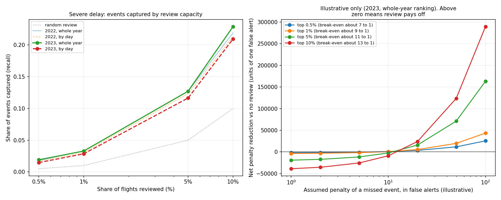

# Calibration and alert-policy report

Airline Network Disruption Intelligence: Delay Prediction, Propagation, Recovery and Network Resilience

This is an advanced portfolio study for Data Science, applied science, forecasting, operations research, decision science, transportation analytics and aviation analytics roles. It is a retrospective analysis of flight-level records. It is not an airline operating system, a dispatch or control tool, a real-time system or a production service.

Generated by `scripts/build_phase7_reports.py` from the result tables listed at the end. Every number comes from those files.

The final test period (2023-01-01 to 2023-08-31) was scored once, under protocol lock `e9d60fd5184a9e38` (first run 2026-10-01T11:16:28+00:00). The lock was sealed before any 2023 row was read.

## What this report covers

Two questions, answered for the selected severe-delay model only (arrival delay of 120 minutes or more, a project definition):

1. Are the model's probabilities reliable, and was the calibration method chosen fairly?
2. If an analyst could review only the top K% of flights ranked by the model, how many severe delays would be in that list?

The prediction time is the scheduled departure time in UTC minus two hours. The model uses only the flight's own schedule (month, weekday, scheduled local departure and arrival time, scheduled elapsed time, distance) and its carrier, origin, destination and route. It uses no outcome of the flight it scores and nothing that happened after the prediction time.

The review scenarios are retrospective. They show how well a ranking separates severe delays after the fact. They are not a procedure for any airline.

## Calibration protocol

- Model: tuned LightGBM, feature set `base_no_year`, seed 42, 53 trees.
- Fit rows: 2019-01 to 2021-06 (UTC prediction time). Early-stopping rows: 2021-07 to 2021-12. Validation: 2022. Final test: 2023-01-01 to 2023-08-31 local flight date (UTC prediction time from 2023-01-01).
- The model was not refitted on 2022 before the final test. The model that was validated is the model that is tested. Refitting on 2019 to 2022 would test a different model whose tree count and calibration were never validated.
- Methods compared on validation data: uncalibrated, platt, isotonic.
- Rule 1 chose **platt**. Platt improved the selection half and the improvement was confirmed on the second half.
- Rule 2 (which rows to fit the final calibrator on) chose the same rows as in the validation experiment (the early-stopping rows). Fitting on more recent rows was not clearly better, so the same kind of rows is used.
- Final calibrator: Platt (sigmoid), p = expit(a + b * logit(score)), fitted on 337,156 early-stopping rows with 8,154 events (event rate 2.42%). a = 0.509, b = 1.078.
- A second Platt calibrator, fitted on all of 2022, is shown as a diagnostic only (a = 0.229, b = 0.983). It was not the locked choice and is never used for a probability statement.
- No calibrator was fitted or chosen with 2023 labels.

## Calibration on 2022 validation data

Calibrators were fitted on the early-stopping rows (2021-07 to 2021-12) and judged on 2022. The first half of 2022 chose settings and the second half confirmed them. Intercept is calibration-in-the-large (0 is ideal; positive means probabilities are too low). Slope is 1 when the spread of probabilities is right.

| Period | Method | Mean predicted | Observed | Predicted / observed | Brier | Brier skill | Slope | Intercept | ECE |
| --- | --- | --- | --- | --- | --- | --- | --- | --- | --- |
| 2022 first half (selection) | uncalibrated | 2.05% | 2.74% | 0.747 | 0.02646 | 0.0062 | 1.033 | 0.300 | 0.0070 |
| 2022 first half (selection) | platt | 2.53% | 2.74% | 0.923 | 0.02641 | 0.0084 | 0.958 | 0.083 | 0.0024 |
| 2022 first half (selection) | isotonic | 2.52% | 2.74% | 0.921 | 0.02642 | 0.0079 | 0.929 | 0.086 | 0.0023 |
| 2022 second half (confirmation) | uncalibrated | 1.97% | 2.60% | 0.756 | 0.02522 | 0.0058 | 0.938 | 0.288 | 0.0063 |
| 2022 second half (confirmation) | platt | 2.43% | 2.60% | 0.932 | 0.02518 | 0.0074 | 0.870 | 0.073 | 0.0023 |
| 2022 second half (confirmation) | isotonic | 2.43% | 2.60% | 0.932 | 0.02519 | 0.0070 | 0.839 | 0.073 | 0.0025 |
| 2022 full year | uncalibrated | 2.01% | 2.67% | 0.752 | 0.02583 | 0.0060 | 0.983 | 0.294 | 0.0066 |
| 2022 full year | platt | 2.48% | 2.67% | 0.928 | 0.02578 | 0.0079 | 0.912 | 0.078 | 0.0021 |
| 2022 full year | isotonic | 2.47% | 2.67% | 0.926 | 0.02579 | 0.0074 | 0.881 | 0.080 | 0.0023 |

Predicted-to-observed ratio by quarter of 2022 (1 is ideal):

| Method | 2022 Q1 | 2022 Q2 | 2022 Q3 | 2022 Q4 |
| --- | --- | --- | --- | --- |
| uncalibrated | 0.746 | 0.749 | 0.830 | 0.677 |
| platt | 0.915 | 0.929 | 1.032 | 0.825 |
| isotonic | 0.912 | 0.927 | 1.033 | 0.824 |

Paired Brier-score differences on the confirmation half (negative favours the challenger; 95% day-bootstrap interval):

| Comparison | Challenger | Reference | Difference | Low | High |
| --- | --- | --- | --- | --- | --- |
| A: calibrator vs uncalibrated | platt | uncalibrated | -4.01e-05 | -7.69e-05 | -6.24e-06 |
| A: calibrator vs uncalibrated | isotonic | uncalibrated | -3.01e-05 | -6.80e-05 | 5.28e-06 |
| A: isotonic vs Platt | isotonic | platt | 1.00e-05 | 2.33e-06 | 1.81e-05 |
| B vs A (recent rows vs older rows) | platt, fitted on 2022 H1 | platt, fitted on 2021 H2 | -1.90e-06 | -1.44e-05 | 9.69e-06 |
| B vs A (recent rows vs older rows) | isotonic, fitted on 2022 H1 | isotonic, fitted on 2021 H2 | -9.38e-06 | -2.43e-05 | 4.57e-06 |

## Calibration on the 2023 final test

The 2023 rows were never used to fit or choose anything. Rows for 2022 are repeated for comparison.

| Period | Variant | Mean predicted | Observed | Predicted / observed | Brier | Brier skill | Slope | Intercept | ECE | PR-AUC |
| --- | --- | --- | --- | --- | --- | --- | --- | --- | --- | --- |
| validation_2022 | uncalibrated | 2.01% | 2.67% | 0.752 | 0.02583 | 0.0060 | 0.983 | 0.294 | 0.0066 | 0.0479 |
| validation_2022 | platt fitted on early_stop (locked primary) | 2.48% | 2.67% | 0.928 | 0.02578 | 0.0079 | 0.912 | 0.078 | 0.0021 | 0.0479 |
| validation_2022 | platt fitted on validation_2022 (diagnostic, not the locked choice) | 2.67% | 2.67% | 1.000 | 0.02578 | 0.0081 | 1.000 | -0.000 | 0.0008 | 0.0479 |
| final_2023 | uncalibrated | 2.12% | 3.19% | 0.667 | 0.03068 | 0.0078 | 1.041 | 0.420 | 0.0106 | 0.0591 |
| final_2023 | platt fitted on early_stop (locked primary) | 2.63% | 3.19% | 0.826 | 0.03056 | 0.0115 | 0.966 | 0.199 | 0.0057 | 0.0591 |
| final_2023 | platt fitted on validation_2022 (diagnostic, not the locked choice) | 2.82% | 3.19% | 0.885 | 0.03055 | 0.0120 | 1.059 | 0.127 | 0.0042 | 0.0591 |

Locked Platt against uncalibrated, Brier difference -1.15e-04 with 95% day-bootstrap interval (-1.51e-04 to -8.13e-05). Negative favours the calibrated probabilities.
The diagnostic calibrator (fitted on 2022) against the locked one: -1.57e-05 (-2.46e-05 to -7.89e-06).

- The event rate was 2.42% in the rows the calibrator was fitted on, 2.67% in 2022 and 3.19% in 2023.
- The locked calibrator's predicted-to-observed ratio was 0.928 on 2022 and 0.826 on 2023. Its slope was 0.912 and 0.966.
- A calibrator fitted on earlier rows cannot know that the event rate has risen, so it under-predicts by more. A slope near 1 means the ordering and spread of the probabilities held. The level is what moved. Probabilities from this model should be read as too low when the event rate is above the calibration period, and a probability threshold fixed in advance is not stable.

PR-AUC is identical across the variants in every period. Platt is strictly increasing, so it cannot change a ranking, and every ranking in this report uses the uncalibrated model score.

Reliability of the locked probabilities on 2023 (ten equal-count bins, lowest scores first):

| Bin | Flights | Events | Mean predicted | Observed rate |
| --- | --- | --- | --- | --- |
| 1 | 45,442 | 367 | 0.90% | 0.81% |
| 2 | 45,442 | 799 | 1.26% | 1.76% |
| 3 | 45,442 | 852 | 1.55% | 1.87% |
| 4 | 45,441 | 1,037 | 1.77% | 2.28% |
| 5 | 45,441 | 1,222 | 2.01% | 2.69% |
| 6 | 45,441 | 1,298 | 2.33% | 2.86% |
| 7 | 45,441 | 1,532 | 2.71% | 3.37% |
| 8 | 45,441 | 1,807 | 3.26% | 3.98% |
| 9 | 45,441 | 2,252 | 4.19% | 4.96% |
| 10 | 45,441 | 3,318 | 6.34% | 7.30% |

## Retrospective review scenarios, severe delay, 2023

A capacity K means the K% of flights with the highest model score are reviewed. Three ways to apply it: one ranking over the whole period, a fixed share inside each month, or a fixed share inside each day. The last is closest to how a review desk would work, because season and weekday cannot help. Rankings use the uncalibrated score. No probability threshold is used in this section.

False alerts per event caught is the break-even ratio: reviewing pays off only if one missed severe delay is worth more than that many false alerts.

**Whole period (one ranking over every flight), 2023** (454,413 flights, 14,484 severe delays):

| Capacity | Reviewed | Events caught | False alerts | Precision | Precision 95% interval | Recall | Lift | False alerts per event caught |
| --- | --- | --- | --- | --- | --- | --- | --- | --- |
| 0.5% | 2,273 | 275 | 1,998 | 12.1% | (10.0% to 14.3%) | 1.9% | 3.80 | 7.3 |
| 1% | 4,545 | 476 | 4,069 | 10.5% | (9.0% to 12.1%) | 3.3% | 3.29 | 8.5 |
| 5% | 22,721 | 1,842 | 20,879 | 8.1% | (7.3% to 9.0%) | 12.7% | 2.54 | 11.3 |
| 10% | 45,442 | 3,318 | 42,124 | 7.3% | (6.6% to 8.0%) | 22.9% | 2.29 | 12.7 |

**Within each month, 2023** (454,413 flights, 14,484 severe delays):

| Capacity | Reviewed | Events caught | False alerts | Precision | Precision 95% interval | Recall | Lift | False alerts per event caught |
| --- | --- | --- | --- | --- | --- | --- | --- | --- |
| 0.5% | 2,274 | 190 | 2,084 | 8.4% | (7.0% to 9.8%) | 1.3% | 2.62 | 11.0 |
| 1% | 4,547 | 372 | 4,175 | 8.2% | (7.0% to 9.4%) | 2.6% | 2.57 | 11.2 |
| 5% | 22,724 | 1,594 | 21,130 | 7.0% | (6.3% to 7.8%) | 11.0% | 2.20 | 13.3 |
| 10% | 45,445 | 3,005 | 42,440 | 6.6% | (6.0% to 7.3%) | 20.7% | 2.07 | 14.1 |

**Within each day, 2023** (454,413 flights, 14,484 severe delays):

| Capacity | Reviewed | Events caught | False alerts | Precision | Precision 95% interval | Recall | Lift | False alerts per event caught |
| --- | --- | --- | --- | --- | --- | --- | --- | --- |
| 0.5% | 2,386 | 212 | 2,174 | 8.9% | (7.5% to 10.5%) | 1.5% | 2.79 | 10.3 |
| 1% | 4,668 | 412 | 4,256 | 8.8% | (7.6% to 10.2%) | 2.8% | 2.77 | 10.3 |
| 5% | 22,837 | 1,686 | 21,151 | 7.4% | (6.6% to 8.2%) | 11.6% | 2.32 | 12.5 |
| 10% | 45,547 | 3,037 | 42,510 | 6.7% | (6.1% to 7.3%) | 21.0% | 2.09 | 14.0 |

Lift (precision divided by the event rate) in 2022 and 2023, side by side:

| Capacity | Lift 2022 whole | Lift 2022 within day | Lift 2023 whole | Lift 2023 within day |
| --- | --- | --- | --- | --- |
| 0.5% | 3.57 | 3.16 | 3.80 | 2.79 |
| 1% | 3.30 | 2.97 | 3.29 | 2.77 |
| 5% | 2.54 | 2.46 | 2.54 | 2.32 |
| 10% | 2.19 | 2.13 | 2.29 | 2.09 |

- Season: the three months with the most alerts at the whole-period top 1% (2023-06, 2023-08, 2023-07) hold 82% of those alerts while holding 39% of the flights and 49% of the severe events.
- Precision at the top 1% is 10.5% for the whole period and 8.8% within each day (lift 3.29 and 2.77). The gap is the part of the whole-period result that comes from knowing which months and days are busy. Quote the within-day figure for ranking skill.

## Fixed cutoffs learned on 2022, applied to 2023

| Operating point | Score cutoff | Probability at cutoff | Flagged 2022 | Flagged 2023 | Precision 2022 | Precision 2023 | Recall 2022 | Recall 2023 | F1 2023 |
| --- | --- | --- | --- | --- | --- | --- | --- | --- | --- |
| capacity_0.5pct | 0.0665 | 8.79% | 0.50% | 0.69% | 9.5% | 11.2% | 1.8% | 2.4% | 0.0396 |
| capacity_1pct | 0.0593 | 7.80% | 1.00% | 1.33% | 8.8% | 9.8% | 3.3% | 4.1% | 0.0574 |
| capacity_5pct | 0.0428 | 5.52% | 5.00% | 6.61% | 6.8% | 8.0% | 12.7% | 16.5% | 0.1074 |
| capacity_10pct | 0.0350 | 4.45% | 10.00% | 12.82% | 5.8% | 6.9% | 21.9% | 27.8% | 0.1107 |
| f1_optimal | 0.0361 | 4.60% | 9.09% | 11.73% | 6.0% | 7.1% | 20.5% | 26.1% | 0.1114 |

Cutoffs were learned on 2022 and applied unchanged to 2023. The cutoff that flagged 10.0% of 2022 flights flagged 12.8% of 2023 flights (1.28 times as many). Scores rose between the two years, so a fixed cutoff flags more flights than planned. A capacity rule (review the top K% of each day) holds the workload fixed.

## Where the alerts land in 2023

One global cutoff per capacity over the whole final period. Share of alerts is the share of the flights flagged at the top 1%.

By scheduled local departure hour:

| Hours | Share of flights | Share of severe events | Share of top 1% alerts | Recall at top 10% | PR-AUC |
| --- | --- | --- | --- | --- | --- |
| 00-05 | 3.1% | 1.9% | 0.0% | 1.8% | 0.0431 |
| 06-09 | 26.2% | 16.1% | 0.2% | 0.9% | 0.0287 |
| 10-13 | 24.2% | 19.8% | 3.4% | 7.3% | 0.0407 |
| 14-17 | 23.2% | 29.9% | 43.0% | 34.5% | 0.0666 |
| 18-23 | 23.3% | 32.4% | 53.5% | 33.9% | 0.0728 |

Departures from 14:00 hold 62% of the severe events and 96% of the top 1% alerts.

Carriers: 4 of 15 carriers with at least 1,000 flights received no top 1% alert. They hold 29% of the flights and 16% of the severe events.

Origin airports with the highest and lowest share of their flights reviewed at the top 1%:

| Airport | Flights | Event rate | Flights reviewed at top 1% | Precision at top 1% | Recall at top 10% |
| --- | --- | --- | --- | --- | --- |
| EWR | 9,218 | 4.9% | 10.66% | 10.9% | 53.8% |
| FLL | 6,050 | 6.3% | 5.37% | 13.5% | 39.8% |
| MCO | 10,926 | 5.5% | 3.84% | 16.0% | 42.9% |
| LGA | 10,847 | 3.2% | 3.37% | 8.5% | 48.1% |
| BOS | 9,298 | 4.1% | 2.79% | 8.9% | 43.2% |
| MSP | 8,224 | 2.1% | 0.00% | n/a | 5.3% |
| PHX | 11,588 | 2.3% | 0.00% | n/a | 2.3% |
| SEA | 10,787 | 1.8% | 0.00% | n/a | 1.0% |
| SFO | 8,931 | 2.6% | 0.00% | n/a | 8.7% |
| SLC | 7,357 | 2.6% | 0.00% | n/a | 1.0% |

Flights with a missing number or a category not seen in the fit rows:

| Group | Flights | Events | Event rate | Recall at top 10% | PR-AUC |
| --- | --- | --- | --- | --- | --- |
| unseen category | 5,048 | 139 | 2.8% | 22.3% | 0.0484 |

## Illustrative penalty analysis

These weights are assumptions made for analysis. They are not airline costs and nothing here estimates a saving. A caught severe delay earns R units, a false alert costs 1 unit, and R is the assumed ratio of the cost of a missed severe delay to the cost of a false alert. The measured quantities (events caught, false alerts) are in the tables above and do not depend on R.

Does reviewing the top K% inside each day beat doing nothing, at each assumed ratio R? 2023, fixed daily capacity:

| Capacity | Break-even (false alerts per event caught) | ratio 1 | ratio 2 | ratio 5 | ratio 10 | ratio 20 | ratio 50 | ratio 100 |
| --- | --- | --- | --- | --- | --- | --- | --- | --- |
| 0.5% | 10.3 | no | no | no | no | pays | pays | pays |
| 1% | 10.3 | no | no | no | no | pays | pays | pays |
| 5% | 12.5 | no | no | no | no | pays | pays | pays |
| 10% | 14.0 | no | no | no | no | pays | pays | pays |

Read the break-even column first: it is the smallest R at which that capacity pays, and it needs no assumption. At 0.5% it is 10.3 false alerts per event caught, at 10% it is 14.0. The smaller review pays at a lower R, because the top of the ranking is more precise. Whether R is anywhere near these values is not something this data can say.

## Pre-registered claims, severe delay

Fixed in the lock before 2023 was read. These are the only pass or fail statements in the final test; everything else is description.

- **C1_skill_over_chance**: supported. PR-AUC lift 1.8545; lower end of the lift interval 1.7291. Rule: The lower end of the 95% day-bootstrap interval of PR-AUC lift (PR-AUC divided by the 2023 event rate) is above 1.0.
- **C2_beats_history**: supported. PR-AUC difference against the history baseline 0.0157; interval low 0.0121; interval high 0.0197. Rule: The whole 95% paired day-bootstrap interval of PR-AUC(LightGBM) minus PR-AUC(best_history_baseline) is above 0. The baseline is the one of carrier, origin, destination and route rate with the highest 2022 PR-AUC, fixed in this lock. Baseline: baseline_carrier_rate.
- **C3_ranking_not_only_seasonal**: supported. precision at 10% inside each day 0.0667; lower end of that interval 0.0606; 2023 event rate 0.0319. Rule: The lower end of the 95% day-bootstrap interval of Precision@10% with a fixed review capacity inside every day is above the 2023 event rate.

## Cancellation

Cancellation was run as an untuned baseline: the severe-delay settings were reused, with no calibration and no thresholds. The 2023 event rate is 1.68% (7,809 cancelled of 463,484 flights).

| Scorer | PR-AUC | 95% interval | Lift | ROC-AUC |
| --- | --- | --- | --- | --- |
| lightgbm_locked | 0.0176 | (0.0151 to 0.0203) | 1.05 | 0.531 |
| baseline_prevalence | 0.0168 | (0.0145 to 0.0195) | 1.00 | 0.500 |
| baseline_carrier_rate | 0.0153 | (0.0129 to 0.0181) | 0.91 | 0.474 |
| baseline_origin_rate | 0.0196 | (0.0165 to 0.0233) | 1.17 | 0.547 |
| baseline_destination_rate | 0.0194 | (0.0162 to 0.0230) | 1.15 | 0.553 |
| baseline_route_rate | 0.0208 | (0.0177 to 0.0244) | 1.24 | 0.563 |

Review lift, whole period and within each day:

| Capacity | Lift, whole period | Lift, within day |
| --- | --- | --- |
| 0.5% | 0.97 | 3.06 |
| 1% | 1.18 | 2.76 |
| 5% | 0.81 | 2.17 |
| 10% | 0.88 | 1.74 |

Month pattern: 98% of the top 1% alerts fall in 2023-04, which holds 12% of the flights; precision there was 2.0% against a cancellation rate of 1.80%. 5 of 8 months received no top 1% alert (2023-01, 2023-02, 2023-06, 2023-07, 2023-08).

Result: cancellation is reported as a negative result. The model shows no demonstrated skill over chance on 2023 and does not beat the best history baseline. The baseline is better, with the whole interval below zero. Ranking inside a single day does beat the event rate, which is a weaker statement than a useful alert list. No calibration, threshold or alert policy was built for it.

Pre-registered claims for cancellation:

- **C1_skill_over_chance**: not supported. PR-AUC lift 1.0452; lower end of the lift interval 0.9674. Rule: The lower end of the 95% day-bootstrap interval of PR-AUC lift (PR-AUC divided by the 2023 event rate) is above 1.0.
- **C2_beats_history**: not supported. PR-AUC difference against the history baseline -0.0032; interval low -0.0051; interval high -0.0014. Rule: The whole 95% paired day-bootstrap interval of PR-AUC(LightGBM) minus PR-AUC(best_history_baseline) is above 0. The baseline is the one of carrier, origin, destination and route rate with the highest 2022 PR-AUC, fixed in this lock. Baseline: baseline_route_rate.
- **C3_ranking_not_only_seasonal**: supported. precision at 10% inside each day 0.0293; lower end of that interval 0.0234; 2023 event rate 0.0168. Rule: The lower end of the 95% day-bootstrap interval of Precision@10% with a fixed review capacity inside every day is above the 2023 event rate.

## Limits

- One period only (January to August 2023). There is no regime comparison inside the final test, and no claim about a full year: the missing autumn and winter months are not scored.
- The model has seen nothing after 2021-06 and the calibrator nothing after 2021-12. The test measures how a model frozen in mid-2021 does on 2023.
- The model uses the schedule only. It has no state of the airport on the day, so it cannot see disruption building up before the prediction time.
- 353 rows across both targets have a UTC prediction time on 2023-09-01 (late flights of 31 August in western time zones). They belong to the final period by flight date.
- Review precision and lift are measured against every flight, so they include all the ways a flight can be late. They do not say which delays an analyst could have acted on.
- The 2023 event rate was seen in earlier descriptive work before the test and is disclosed in DEC-027. No model, calibration or policy choice used it.

## What the evidence does not support

- weather or any other cause of a delay (the data holds no weather and no cause for the flights scored here)
- aircraft or tail-number propagation (the source has no usable tail identifier, so no aircraft sequence is built)
- causal statements about airports, carriers, routes or schedules (every result is an association)
- real airline costs, savings or operating decisions (utility figures are illustrative penalty units)
- any claim about flights after 2023-08-31, or about other airlines or countries

## Inputs

Files read to build this report (SHA-256 of each is in `reports/tables/phase7_reports_manifest.json`):

- `configs/calibration_selected.json`
- `reports/final/final_protocol_lock.json`
- `reports/final/final_test_consumed.json`
- `reports/tables/calibration_summary.csv`
- `reports/tables/phase6_calibration_comparisons.csv`
- `reports/tables/phase7b_final_cancelled_by_group.csv`
- `reports/tables/phase7b_final_cancelled_capacity.csv`
- `reports/tables/phase7b_final_cancelled_summary.csv`
- `reports/tables/phase7b_final_decision.json`
- `reports/tables/phase7b_final_severe_delay_120_by_group.csv`
- `reports/tables/phase7b_final_severe_delay_120_calibration.csv`
- `reports/tables/phase7b_final_severe_delay_120_capacity.csv`
- `reports/tables/phase7b_final_severe_delay_120_operating_points.csv`
- `reports/tables/phase7b_final_severe_delay_120_reliability.csv`
- `reports/tables/phase7b_final_severe_delay_120_summary.csv`
- `reports/tables/phase7b_final_severe_delay_120_utility.csv`

Every file the builder looked for was found.
