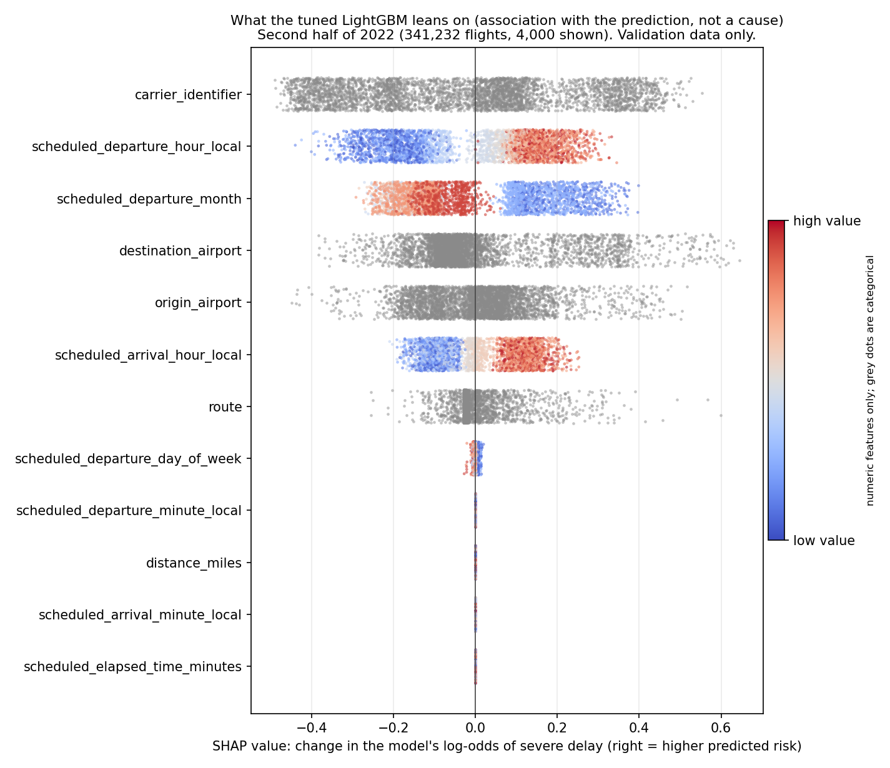
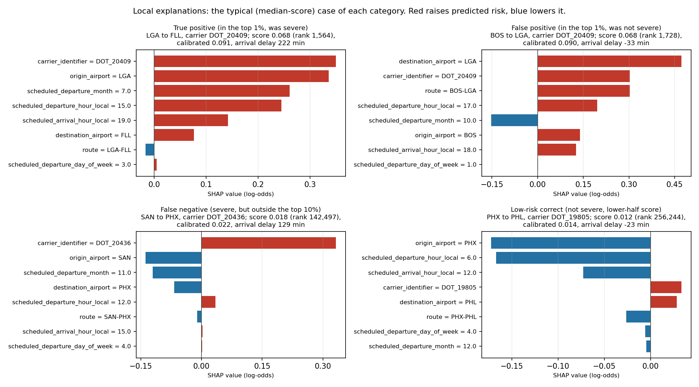

# Explainability report

Airline Network Disruption Intelligence: Delay Prediction, Propagation, Recovery and Network Resilience

This is an advanced portfolio study for Data Science, applied science, forecasting, operations research, decision science, transportation analytics and aviation analytics roles. It is a retrospective analysis of flight-level records. It is not an airline operating system, a dispatch or control tool, a real-time system or a production service.

Generated by `scripts/build_phase7_reports.py` from the result tables listed at the end. Every number comes from those files.

The final test period (2023-01-01 to 2023-08-31) was scored once, under protocol lock `e9d60fd5184a9e38` (first run 2026-10-01T11:16:28+00:00). The lock was sealed before any 2023 row was read.

## What an explanation says here

SHAP values describe how the model reaches its score. A large positive value for an airport means the model has learned, from the 2019 to mid-2021 flights it was fitted on, that flights from that airport go with more severe delays. It is an association inside the model. It is not a cause of delay, and it says nothing about weather, aircraft or crews, which the data does not hold.

Values are in log-odds. A positive value moves a flight's score above the average flight, a negative value below. Where features overlap (an airport, a route and a carrier often say the same thing) the credit is shared between them, so read a family total, not a single bar, when two features are close.

## Model and data explained

- Model: tuned LightGBM, feature set `base_no_year`, seed 42, 53 trees. This is the model that was locked and later scored on 2023.
- SHAP values were computed on 341,232 flights from the 2022 second half (validation data). They were checked to add up to the model's own output (largest gap 8.9e-15 log-odds).
- The average flight sits at -4.009 log-odds, a score of 1.78%.
- The 2023 final test was used for scoring only. No explanation, feature choice or model choice was drawn from it.

## Global importance

| Feature | Family | Mean absolute SHAP | Share of total |
| --- | --- | --- | --- |
| carrier_identifier | carrier | 0.2138 | 24.8% |
| scheduled_departure_hour_local | calendar and clock | 0.1516 | 17.6% |
| scheduled_departure_month | calendar and clock | 0.1449 | 16.8% |
| destination_airport | airport | 0.1189 | 13.8% |
| origin_airport | airport | 0.0957 | 11.1% |
| scheduled_arrival_hour_local | calendar and clock | 0.0957 | 11.1% |
| route | route | 0.0402 | 4.7% |
| scheduled_departure_day_of_week | calendar and clock | 0.0025 | 0.3% |
| scheduled_departure_minute_local | calendar and clock | 0.0000 | 0.0% |
| distance_miles | trip length | 0.0000 | 0.0% |

By feature family (shares add to 100%):

| Family | Mean absolute SHAP | Share of total |
| --- | --- | --- |
| calendar and clock | 0.3946 | 45.7% |
| airport | 0.2146 | 24.9% |
| carrier | 0.2138 | 24.8% |
| route | 0.0402 | 4.7% |
| trip length | 0.0000 | 0.0% |

The largest family is calendar and clock at 45.7%. Carrier, airport and route together hold 54.3%. The model's features are the flight's schedule and its carrier, airports and route, so what it can express is mainly when, where and with whom a flight runs.

## Direction of the effects

Mean SHAP value by fifth of the feature (numeric) and by level (categories). Positive means a higher score.

`scheduled_departure_month`:

| Range | Flights | Mean SHAP |
| --- | --- | --- |
| 6 to 8 | 68,247 | +0.187 |
| 8 to 9 | 68,246 | +0.081 |
| 9 to 10 | 68,246 | -0.148 |
| 10 to 11 | 68,246 | -0.150 |
| 11 to 12 | 68,247 | -0.079 |

`scheduled_departure_hour_local`:

| Range | Flights | Mean SHAP |
| --- | --- | --- |
| 0 to 8 | 68,247 | -0.209 |
| 8 to 11 | 68,246 | -0.161 |
| 11 to 15 | 68,246 | +0.051 |
| 15 to 18 | 68,246 | +0.158 |
| 18 to 23 | 68,247 | +0.162 |

`scheduled_arrival_hour_local`:

| Range | Flights | Mean SHAP |
| --- | --- | --- |
| 0 to 10 | 68,247 | -0.099 |
| 10 to 13 | 68,246 | -0.097 |
| 13 to 16 | 68,246 | -0.040 |
| 16 to 20 | 68,246 | +0.113 |
| 20 to 23 | 68,247 | +0.123 |

`distance_miles`:

| Range | Flights | Mean SHAP |
| --- | --- | --- |
| 31 to 331 | 68,247 | +0.000 |
| 331 to 547 | 68,246 | +0.000 |
| 547 to 813 | 68,246 | +0.000 |
| 813 to 1167 | 68,246 | +0.000 |
| 1167 to 5095 | 68,247 | +0.000 |

`carrier_identifier`, five levels with the highest and five with the lowest mean SHAP value:

| Direction | Level | Flights | Mean SHAP |
| --- | --- | --- | --- |
| highest | DOT_20378 | 5,246 | +0.408 |
| highest | DOT_20368 | 5,615 | +0.396 |
| highest | DOT_20436 | 8,188 | +0.374 |
| highest | DOT_20409 | 13,783 | +0.361 |
| highest | DOT_20397 | 9,877 | +0.297 |
| lowest | DOT_19393 | 68,214 | -0.363 |
| lowest | DOT_19690 | 3,995 | -0.362 |
| lowest | DOT_19930 | 11,755 | -0.254 |
| lowest | DOT_19790 | 46,354 | -0.183 |
| lowest | DOT_20452 | 14,320 | -0.077 |

`origin_airport`, five levels with the highest and five with the lowest mean SHAP value:

| Direction | Level | Flights | Mean SHAP |
| --- | --- | --- | --- |
| highest | EWR | 6,393 | +0.310 |
| highest | LGA | 8,422 | +0.291 |
| highest | HPN | 680 | +0.249 |
| highest | BHM | 695 | +0.177 |
| highest | JFK | 6,856 | +0.172 |
| lowest | PDX | 3,059 | -0.236 |
| lowest | SLC | 5,495 | -0.234 |
| lowest | SJC | 2,959 | -0.191 |
| lowest | PHX | 8,293 | -0.154 |
| lowest | ATL | 16,274 | -0.148 |

## Local explanations and case studies

Cases were chosen by a fixed rule from score and label only, on the second half of 2022 (validation data): false_negative 3, false_positive 3, high_confidence_false_negative 3, high_confidence_false_positive 3, low_risk_correct 3, true_positive 3 rows. Each category shows the typical case (the median by score) here; the quartile cases and extremes are in `reports/tables/phase7a_case_studies.csv`. The arrival delay is the realised outcome and is used to describe a case after the fact, never as a model input.

Typical case of each category:

| Case | Trip | Carrier | Local departure hour | Score rank in 2022 H2 | Calibrated probability | Severe | Arrival delay (min) |
| --- | --- | --- | --- | --- | --- | --- | --- |
| Correct high-risk alert (top 1%, severe) | LGA to FLL | DOT_20409 | 15 | 1,564 | 9.07% | yes | 222 |
| False alarm (top 1%, not severe) | BOS to LGA | DOT_20409 | 17 | 1,728 | 8.96% | no | -33 |
| Missed severe delay (outside the top 10%) | SAN to PHX | DOT_20436 | 12 | 142,497 | 2.24% | yes | 129 |
| Low-risk and correct (not severe, lower-half score) | PHX to PHL | DOT_19805 | 6 | 256,244 | 1.43% | no | -23 |

The most confident mistakes:

| Case | Trip | Carrier | Local departure hour | Score rank in 2022 H2 | Calibrated probability | Severe | Arrival delay (min) |
| --- | --- | --- | --- | --- | --- | --- | --- |
| Most confident false alarm (highest-scoring non-event) | MCO to EWR | DOT_20409 | 17 | 1 | 15.58% | no | -8 |
| Most confident false alarm (highest-scoring non-event) | ASE to ORD | DOT_20304 | 12 | 3 | 15.44% | no | 13 |
| Most confident false alarm (highest-scoring non-event) | ASE to ORD | DOT_20304 | 12 | 4 | 15.44% | no | 16 |
| Most confident miss (lowest-scoring event) | LAS to SJC | DOT_19393 | 7 | 340,336 | 0.73% | yes | 124 |
| Most confident miss (lowest-scoring event) | HNL to ITO | DOT_19690 | 9 | 340,682 | 0.72% | yes | 138 |
| Most confident miss (lowest-scoring event) | OGG to HNL | DOT_19690 | 9 | 341,146 | 0.70% | yes | 146 |

The features that moved each typical case most, in log-odds:

- Correct high-risk alert (top 1%, severe): carrier_identifier=DOT_20409 (+0.350); origin_airport=LGA (+0.336); scheduled_departure_month=7.0 (+0.261); scheduled_departure_hour_local=15.0 (+0.245); scheduled_arrival_hour_local=19.0 (+0.142); destination_airport=FLL (+0.076)
- False alarm (top 1%, not severe): destination_airport=LGA (+0.472); carrier_identifier=DOT_20409 (+0.303); route=BOS-LGA (+0.302); scheduled_departure_hour_local=17.0 (+0.196); scheduled_departure_month=10.0 (-0.153); origin_airport=BOS (+0.139)
- Missed severe delay (outside the top 10%): carrier_identifier=DOT_20436 (+0.332); origin_airport=SAN (-0.138); scheduled_departure_month=11.0 (-0.121); destination_airport=PHX (-0.068); scheduled_departure_hour_local=12.0 (+0.035); route=SAN-PHX (-0.011)
- Low-risk and correct (not severe, lower-half score): origin_airport=PHX (-0.172); scheduled_departure_hour_local=6.0 (-0.167); scheduled_arrival_hour_local=12.0 (-0.073); carrier_identifier=DOT_19805 (+0.033); destination_airport=PHL (+0.028); route=PHX-PHL (-0.026)

## Sequence-model checks

**LSTM** (341,232 flights of the 2022 second half (validation), lookback of 16 bins; reloaded model reproduces the stored PR-AUC to 0.0e+00)

| Input change | What was done | Change in PR-AUC | 95% interval | Verdict |
| --- | --- | --- | --- | --- |
| no_sequence | lookback removed (no real step) | -0.00114 | (-0.00255 to -0.00014) | PR-AUC falls, whole interval below zero: the network relies on this input |
| shuffled_lookbacks | each flight gets another flight's lookback (same batch) | -0.00365 | (-0.00569 to -0.00206) | PR-AUC falls, whole interval below zero: the network relies on this input |
| keep_newest_1 | only the newest 1 of 16 bins kept | -0.00024 | (-0.00101 to 0.00057) | no clear change: the interval includes zero |
| keep_newest_4 | only the newest 4 of 16 bins kept | -0.00035 | (-0.00108 to 0.00027) | no clear change: the interval includes zero |
| keep_newest_8 | only the newest 8 of 16 bins kept | +0.00013 | (-0.00011 to 0.00037) | no clear change: the interval includes zero |
| mask_oldest_quarter | bins 0 to 3 hidden (0 is the oldest) | -0.00001 | (-0.00012 to 0.00009) | no clear change: the interval includes zero |
| mask_second_oldest_quarter | bins 4 to 7 hidden (0 is the oldest) | +0.00005 | (-0.00024 to 0.00039) | no clear change: the interval includes zero |
| mask_second_newest_quarter | bins 8 to 11 hidden (0 is the oldest) | -0.00064 | (-0.00156 to 0.00001) | no clear change: the interval includes zero |
| mask_newest_quarter | bins 12 to 15 hidden (0 is the oldest) | -0.00132 | (-0.00219 to -0.00050) | PR-AUC falls, whole interval below zero: the network relies on this input |

3 of 9 input changes moved PR-AUC clearly (interval excludes zero): no_sequence, shuffled_lookbacks, mask_newest_quarter.

| Sequence availability | Flights | Event rate | PR-AUC | Lift |
| --- | --- | --- | --- | --- |
| full (16 real bins) | 341,232 | 2.60% | 0.0454 | 1.74 |

Perturbation means changing what the trained network sees (removing the lookback, shuffling it between flights, keeping only the newest bins, hiding one quarter) and measuring how PR-AUC moves. It shows what the network uses, not why a flight is delayed. Attention weights are not reported as explanations.

Challengers rejected on validation evidence before the final test (none was scored on 2023):

- lstm: did not beat the MLP control that never sees the lookback (DEC-020)
- gru: no clear gain over the LSTM or the MLP control (DEC-020)
- transformer: whole interval below zero against both the MLP control and tuned LightGBM, overfits from epoch 1 (DEC-022)
- mlp_control: not better than tuned LightGBM on validation

## How this connects to the 2023 errors

The calendar and clock family holds 45.7% of the explanation mass (departure hour 17.6%, month 16.8%) and carrier, airport and route hold 54.3%. A model built from these ranks flights by time of day, time of year and who flies where. `reports/evaluation/error_analysis_report.md` shows where that pattern fails on 2022 and 2023.

## Limits

- SHAP was computed on validation data and describes the locked model, not the 2023 flights.
- Features that overlap share credit, so single-feature rankings can move if a related feature is added.
- No explanation here is a statement about why a flight was late.
- Not evaluated here: 2019 and 2020 regimes (training years for this model).
- Not evaluated here: sequence availability and length (the tabular model has no sequence input).
- Not evaluated here: large regression errors and airport recovery episodes (no regression model or episode table is loaded here).

## What the evidence does not support

- weather or any other cause of a delay (the data holds no weather and no cause for the flights scored here)
- aircraft or tail-number propagation (the source has no usable tail identifier, so no aircraft sequence is built)
- causal statements about airports, carriers, routes or schedules (every result is an association)
- real airline costs, savings or operating decisions (utility figures are illustrative penalty units)
- any claim about flights after 2023-08-31, or about other airlines or countries

## Inputs

Files read to build this report (SHA-256 of each is in `reports/tables/phase7_reports_manifest.json`):

- `configs/calibration_selected.json`
- `reports/final/final_protocol_lock.json`
- `reports/final/final_test_consumed.json`
- `reports/tables/calibration_summary.csv`
- `reports/tables/phase6_calibration_comparisons.csv`
- `reports/tables/phase7a_case_studies.csv`
- `reports/tables/phase7a_explain_decision.json`
- `reports/tables/phase7a_sequence_availability_lstm.csv`
- `reports/tables/phase7a_sequence_perturbation_lstm.csv`
- `reports/tables/phase7a_sequence_perturbation_lstm_decision.json`
- `reports/tables/phase7a_shap_categorical_effects.csv`
- `reports/tables/phase7a_shap_family.csv`
- `reports/tables/phase7a_shap_global.csv`
- `reports/tables/phase7a_shap_numeric_effects.csv`
- `reports/tables/phase7b_final_cancelled_by_group.csv`
- `reports/tables/phase7b_final_cancelled_capacity.csv`
- `reports/tables/phase7b_final_cancelled_summary.csv`
- `reports/tables/phase7b_final_decision.json`
- `reports/tables/phase7b_final_severe_delay_120_by_group.csv`
- `reports/tables/phase7b_final_severe_delay_120_calibration.csv`
- `reports/tables/phase7b_final_severe_delay_120_capacity.csv`
- `reports/tables/phase7b_final_severe_delay_120_operating_points.csv`
- `reports/tables/phase7b_final_severe_delay_120_reliability.csv`
- `reports/tables/phase7b_final_severe_delay_120_summary.csv`
- `reports/tables/phase7b_final_severe_delay_120_utility.csv`

Every file the builder looked for was found.
